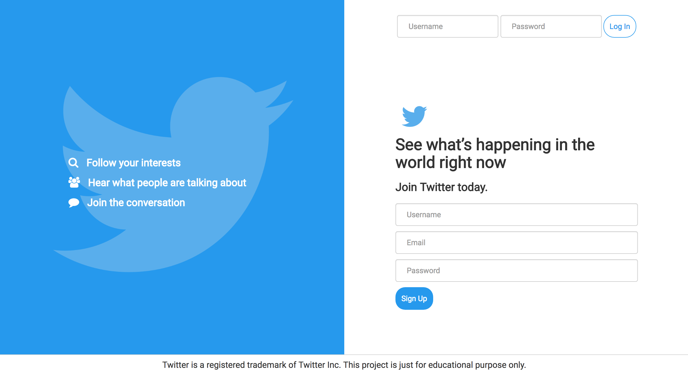
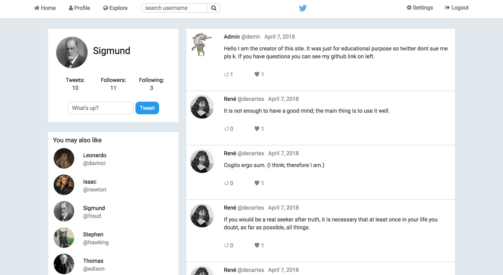
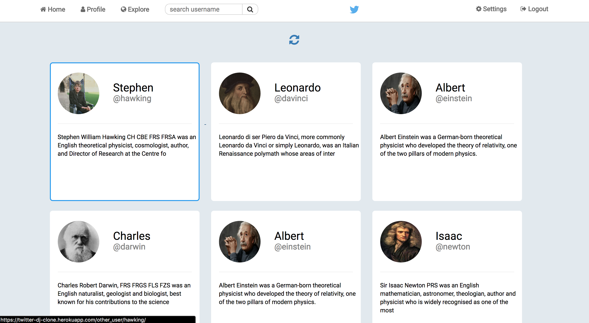
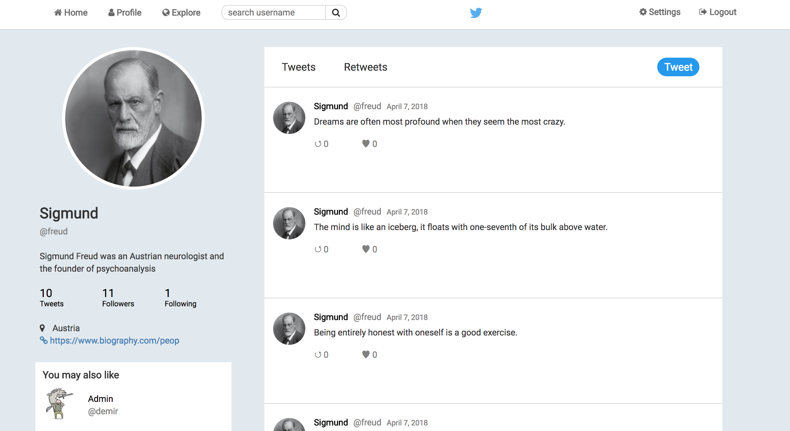
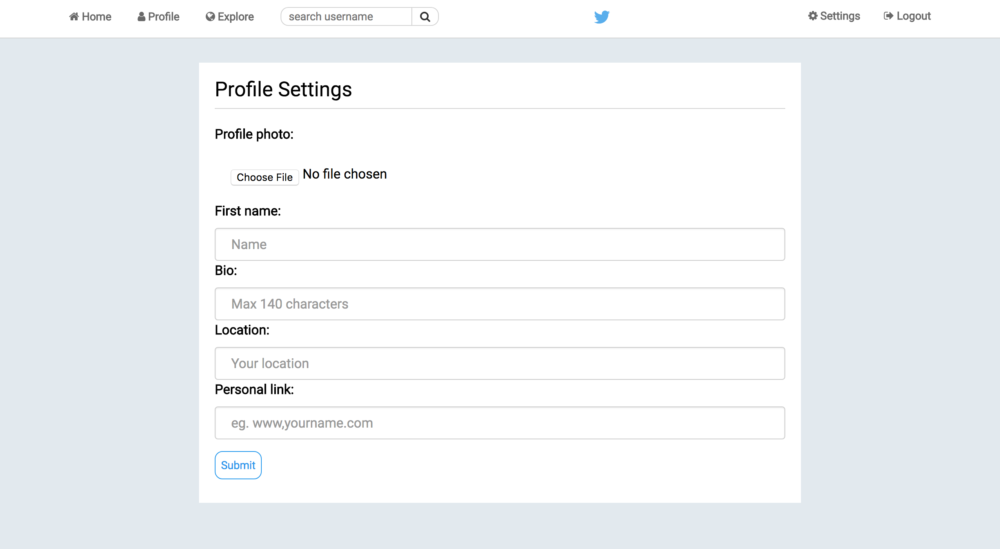

# twitter-clone
Twitter clone built with Django

This is the website but I may remove the heroku hosting so if the link is dead there are images below.
https://twitter-dj-clone.herokuapp.com/

example accounts: 
- Username: darwin | Password: darwin
- Username: davinci | Passowr: davinci
- Username: edison | Passowr: edison
- Username: tesla | Passowr: tesla

## Secreen Shots 

---

---

---

---

